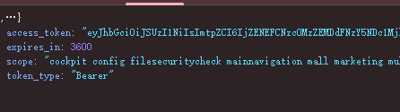
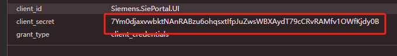
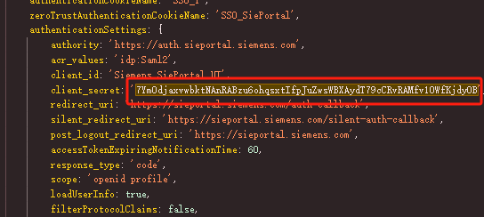

# -pdf-
简单ajax爬虫
support_content 一个小加密，层级搜索就能搜索到参数。
三步之内必有解药

## 进度条：

    total_size = int(response.headers.get('content-length', 0))
    # 用 tqdm 包装写入过程，实现进度条
    with open(down_path, 'wb') as f, tqdm(
            desc=f"\033[92m📥 下载中: {down_path}\033[0m",  # 定义前置文本
            total=total_size,  # 比例后置数字
            unit='B',  # 这个应该是进度条大小
            unit_scale=True,  # 显示进度条
            unit_divisor=1024,  # 每次写入的字符大小
            ncols=200,  # desc+进度条的文本长度，超过了就不会显示进度条
            colour='white'  # 定义进度条颜色
    ) as bar:

        for chunk in response.iter_content(chunk_size=1024):
            if chunk:
                f.write(chunk)
                bar.update(len(chunk))

## 封装requests

    class RequestsWrapper:
        def __init__(self, retries=3, backoff_factor=0.3, timeout=10, status_forcelist=(500, 502, 504)):
            self.session = requests.Session()
            self.timeout = timeout
    
            # 配置重试策略
            retry_strategy = Retry(
                total=retries,
                status_forcelist=status_forcelist,
                allowed_methods=["HEAD", "GET", "OPTIONS", "POST", "PUT", "DELETE"],
                backoff_factor=backoff_factor,
                raise_on_status=False
            )
    
            adapter = HTTPAdapter(max_retries=retry_strategy)
            self.session.mount("http://", adapter)
            self.session.mount("https://", adapter)
    
        def request(self, method, url, **kwargs):
            kwargs.setdefault("timeout", self.timeout)
            try:
                response = self.session.request(method, url, **kwargs)
                response.raise_for_status()  # 若响应为 4xx 或 5xx，会抛出异常
                return response
            except requests.RequestException as e:
                print(f"[ERROR] Request to {url} failed: {e}")
                return None
    
        def get(self, url, **kwargs):
            return self.request("GET", url, **kwargs)
    
        def post(self, url, **kwargs):
            return self.request("POST", url, **kwargs)
    
        def put(self, url, **kwargs):
            return self.request("PUT", url, **kwargs)
    
        def delete(self, url, **kwargs):
            return self.request("DELETE", url, **kwargs)